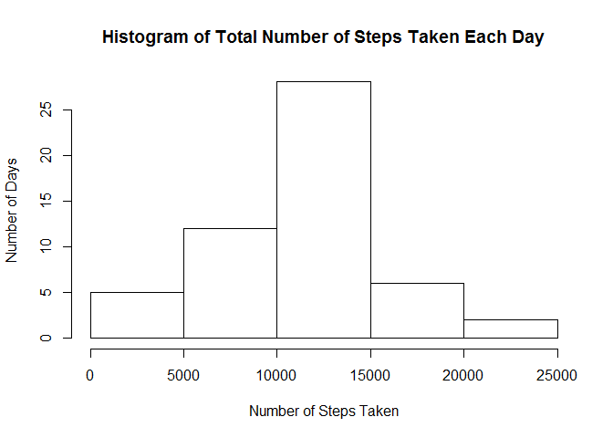
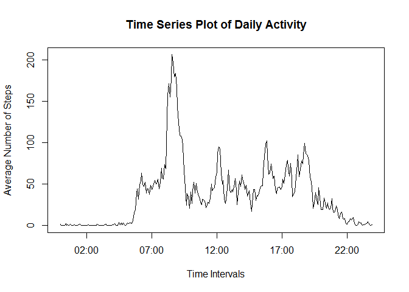
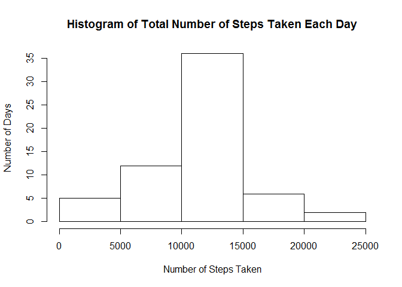
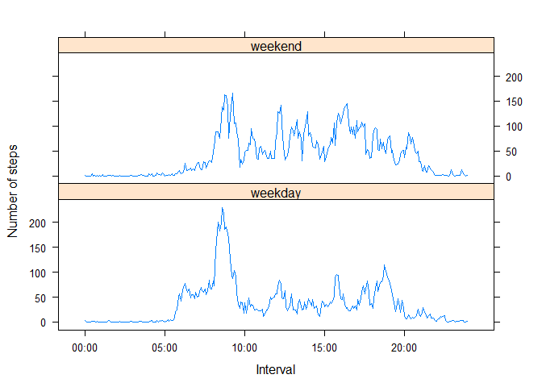

# Peer Assessement 1
#---------------------------------
####Loading and preprocessing the data

1.  Load the data


```r
unzip("activity.zip")
activity <- read.csv("activity.csv")
```

2.  Process the data

- convert the "interval" data into 4 digits format by add leading zeros (0s).  Say, "5" into "0005", "10" into "0010"
- convert the "timestamp" data into date-time format
- convert the "date" data into date format


```r
#convert interval into time format
activity$interval <- as.character(activity$interval)
activity$interval <- sapply(activity$interval, function(x) if (nchar(x) == 1) x <- paste("000", x, sep="")
                            else if (nchar(x) == 2) x <- paste("00", x, sep="")
                            else if (nchar(x) == 3) x <- paste("0", x, sep="")
                            else if (nchar(x) == 4) x <- paste(x)
                        )

activity$timestamp <- as.POSIXct(paste(as.character(activity$date), activity$interval, sep = " "), format = "%Y-%m-%d %H%M")
activity$date <- as.Date(as.character(activity$date))
```

####What is the mean total number of steps taken per day?

1.  Calculate the total number of steps taken per day


```r
totalsteps <- tapply(activity$step, activity$date, sum)
```

2.  Make a histogram of the total number of steps taken each day


```r
hist(totalsteps, main = "Histogram of Total Number of Steps Taken Each Day", xlab = "Number of Steps Taken", ylab = "Number of Days")
```

 

3.  Calculate and report the mean and median of the total number of steps taken per day

- Mean of the total number of steps taken per day

```r
mean(totalsteps, na.rm = TRUE)
```

```
## [1] 10766.19
```

- Median of the total number of steps taken per day

```r
median(totalsteps, na.rm = TRUE)
```

```
## [1] 10765
```

####What is the average daily activity pattern

1.  Make a time series plot of the 5-minute interval and the average number of steps taken, averages across all days


```r
averagesteps <- tapply(activity$step, activity$interval, mean, na.rm = TRUE)
stepstable <- data.frame(time = names(averagesteps), steps = averagesteps)
stepstable$time <- strptime(stepstable$time, "%H%M")

with(stepstable, plot(time, steps, type="l", xlab = "Time Intervals", ylab = "Average Number of Steps", main ="Time Series Plot of Daily Activity"))
```

 

2.  Which 5-minute interval, on average across all the days in the dataset, contains the maximum number of steps?


```r
maxsteps <- stepstable[,2]==max(stepstable$step)

cat("The maximum number of steps (on average across all the days) is at",format(stepstable[maxsteps,1],"%H:%M"))
```

```
## The maximum number of steps (on average across all the days) is at 08:35
```

####Inputing missing values

1.  Calculate and report the total number of missing values in the dataset (i.e. the total number of rows with NAs)


```r
complete <- complete.cases(activity)

cat("Total number of missing values in the dataset (i.e. the total number of rows with NAs) is", length(complete[complete==FALSE]))
```

```
## Total number of missing values in the dataset (i.e. the total number of rows with NAs) is 2304
```

2.  Devise a strategy for filling in all the missing values in the dataset

- Get the 5-minute interval where there is an NA
- Fill the missing value with the average computed (across all days) for that 5-minute interval


```r
filledsteps <- apply(activity, 1, function(x)
                                    if (is.na(x[1])){
                                        rownumber <- row.names(stepstable) == x[3]
                                        x[1] <- stepstable[rownumber,2]
                                    } else {
                                        x[1]
                                    })
```

3.  Create a new dataset that is equal to the original dataset but with the missing data filled in


```r
filledactivity <- activity
filledactivity$steps <- as.numeric(filledsteps)
```

4.  Make a histogram of the total number of steps taken each day


```r
totalfilledsteps <- tapply(filledactivity$step, filledactivity$date, sum)
hist(totalfilledsteps, main = "Histogram of Total Number of Steps Taken Each Day", xlab = "Number of Steps Taken", ylab = "Number of Days")
```

 

- Mean total number of steps taken per day


```r
mean(totalfilledsteps)
```

```
## [1] 10766.19
```

- Median total number of steps taken per day


```r
median(totalfilledsteps)
```

```
## [1] 10766.19
```

The mean does not differ.  

The median is affected as the total number of steps is HIGHER for each day as the missing values are filled in.

#### Are there differences in activity patterns between weekdays and weekends?

1.  Create a new factor variable in the dataset with two levels = "weekday" and "weekend"


```r
filledactivity$dayofweek <- weekdays(filledactivity$timestamp)
dayidentifier <- apply(filledactivity, 1, function(x)
                                        if ((x[5]=="Saturday") | (x[5] == "Sunday")){
                                            x <- "weekend"
                                        } else {
                                            x <- "weekday"
                                        })

filledactivity$dayofweek <- dayidentifier

avesteps <- tapply(filledactivity$step, list(filledactivity$interval, filledactivity$dayofweek), mean, na.rm=TRUE)

weekdaystepstable <- data.frame(time = row.names(avesteps))
weekdaystepstable$time <- strptime(weekdaystepstable$time, "%H%M")
weekdaystepstable$steps <- avesteps[,1]
weekdaystepstable$day <- "weekday"

weekendstepstable <- data.frame(time = row.names(avesteps))
weekendstepstable$time <- strptime(weekendstepstable$time, "%H%M")
weekendstepstable$steps <- avesteps[,2]
weekendstepstable$day <- "weekend"

combinestepstable <- rbind(weekdaystepstable, weekendstepstable)
combinestepstable <- transform(combinestepstable, day = factor(day))
combinestepstable$time <- as.POSIXct(combinestepstable$time)
```

2.  Make a panel plot containing a time series plot of the 5-minute interval (x-axis) and the average number of steps taken, averaged across all weekday days or weekend days (y-axis).


```r
library(lattice)
xyplot(steps ~ time | day, data = combinestepstable, 
       scales=list(x=list(at= seq(combinestepstable[1,1], by="5 hour", length = 5),
                          labels= format(seq(combinestepstable[1,1], by="5 hour", length = 5), "%H:%M"))),
       layout = c(1,2), type = "l", xlab = "Interval", ylab = "Number of steps")
```

 
